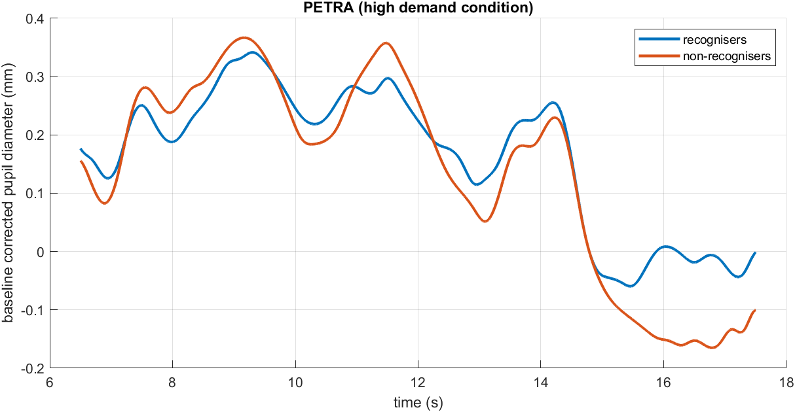
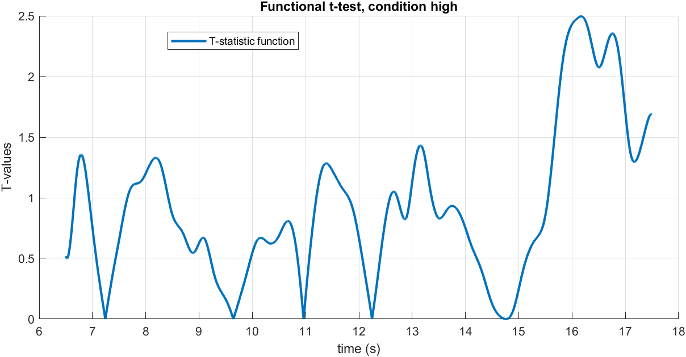
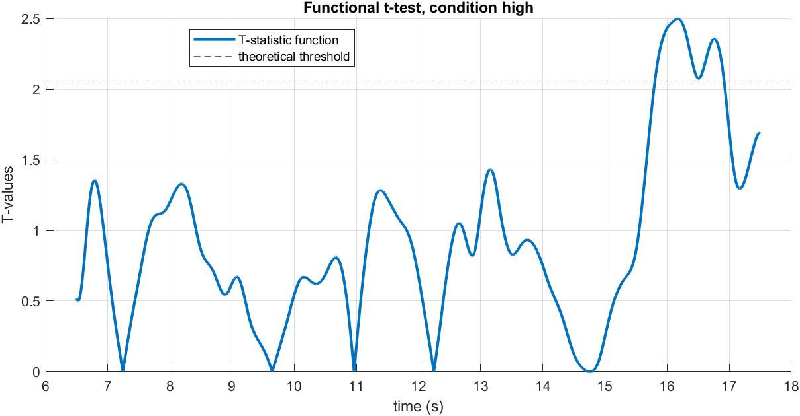
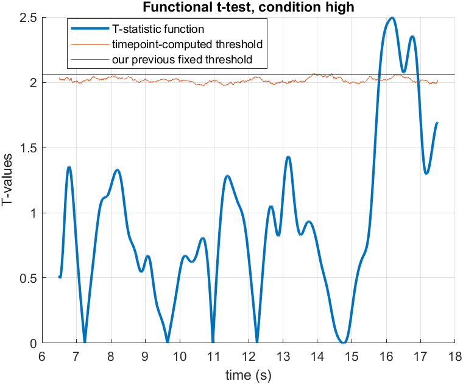
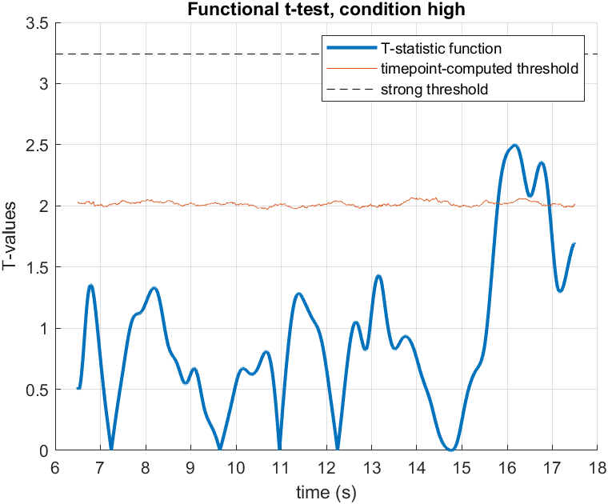
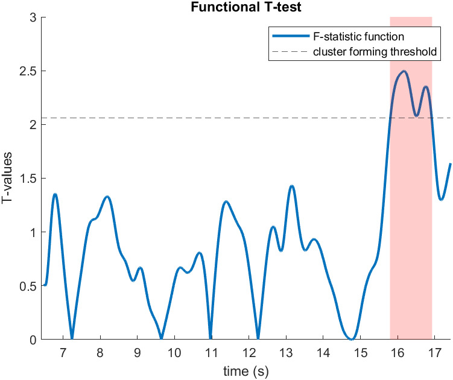
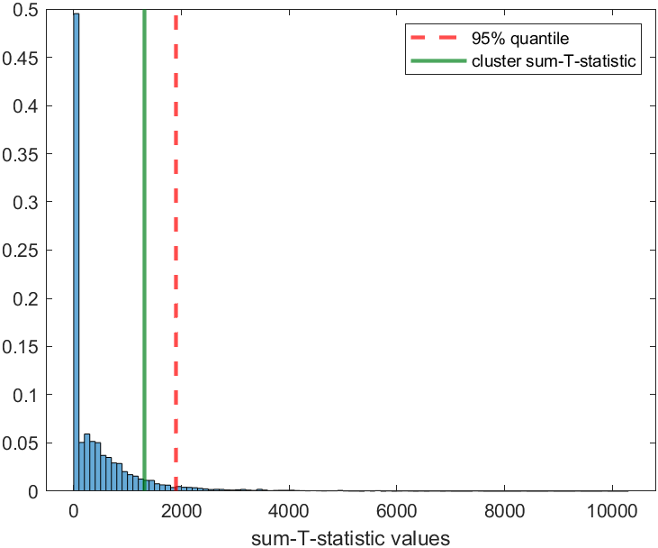
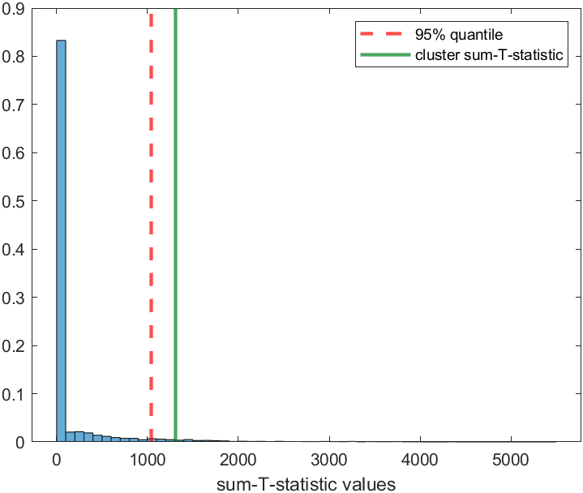
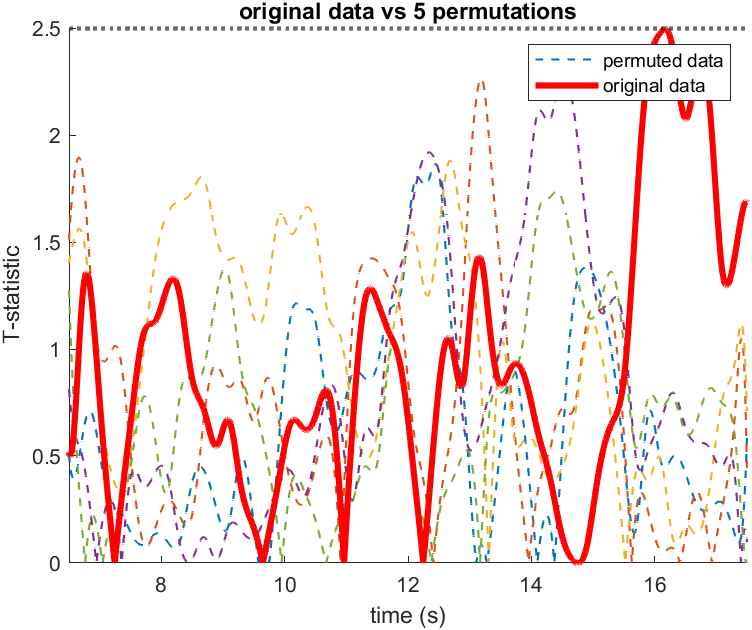
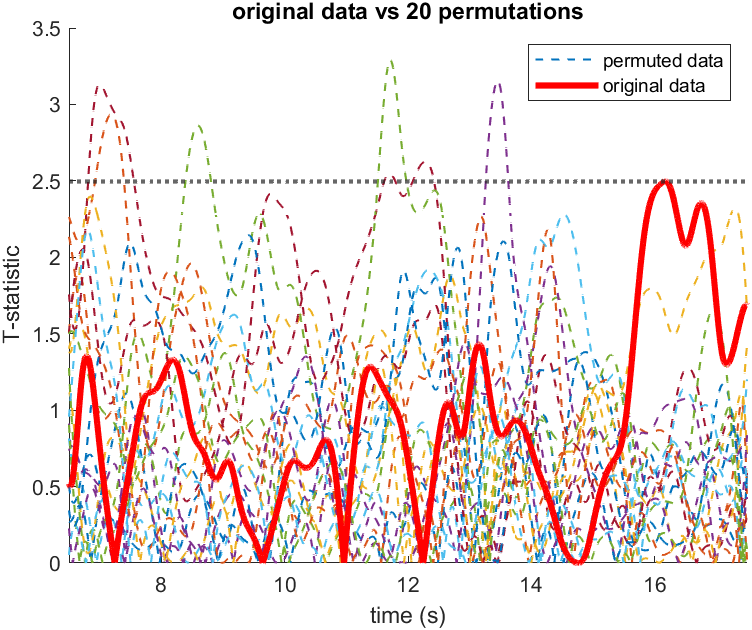

w# Functional Data Analysis (and cluster based permutations)

## What is FDA? Why to use it? (Part I)

Functional Data Analysis is an alternative approach for working with data timeseries. 

Instead of doing reducing the data timeseries to single _numbers_ (for example by averaging or using peaks etc) and do statistical tests on them, we treat the timeseries as a _whole object_ (eg as curves, in the simple one-dimensional data case) on which we do statistics. 

This has certain advantages in certain cases compared to standard methods:

- Methods like averaging may wash out effects.
- It gives better indications on the onset/offset of effects (though care in how these should be reported should be applied)
- It gives a relative flexibility in how precise one's predictions should be.
- It offers more effective ways in dealing with multiple comparison issues, compared to doing standard timebin analyses.
- More advanced versions can deal with higher dimensional data (for example, where we have data in both space and time; like in EEG, where we have time and channels)

However, it has limitations:

- Data should be smooth enough. It could be a case where averaging could give an effect while FDA would not achieve significance levels, if there is enough noise.
- Will not work when the effects are small and the predictions are inprecise (but nothing can reliably work there).
- Multiple comparisons still hard to resolve, if effect is small.

How it is used in the pupillometry literature though:

- People do not really resolve multiple comparison issues.
- FDA is reduced to "doing a t-test at every time bin" which is not really the point in it (and we would not need a new name to do that)

## What tests can become FDA? (+ what is implemented)

FDA is a broad term of doing statistical analysis to timeseries data. A lot of different tests can have a functional version: basically anything that uses a T or F statistic can be done functionally (ie on the data timeseries): by computing the timeseries of T or F statistics.

Essentially: computing the T statistic at every time point (as we would do if we were trying to do a t-test at that time point) and then forming the timeseries of these t-statistics. In this way we get a T-function (a sequence of T statistics each corresponding to a specific time point) instead of a number.

Afterwards, we use some statistical threshold to determine which parts of these timeseries are significant (eg for α=0.05). For example, in this case we use a fixed threshold of T_thress = 2.0595. The time points in which the curve is above this threshold are considered showing a significant effect.

In our code: right now functional T tests, one way ANOVA, and 2x2 mixed ANOVA are implemented. Anything can be implemented easily, the more involved part would be to make it computationally efficient.

## Multiple comparisons: a deep dive into permutations and clusters.

As we said, FDA it is sort of like performing a statistical test at every time point. In the example we showed, this was exactly what we did. This gives naturally gives rise to multiple comparison issues.

Hereby lies the first strength of FDA: the ability to run permutation analysis on the curves.

### What is permutation analysis

Imagine PETRA in the high conflict condition. We have two groups of infants (mirror recognisers, and non recognisers) and we want to see if there is difference in the pupil dilation between groups. This corresponds to a two-sample T-test.

The FDA from our original data looks like this:

Now, we permute the data: we randomly shuffle the labels between mirror recognisers and non-recognisers.

**Why do we do that?**

Under the null hypothesis, these group labels are exchangeable because there is no difference between groups.

Doing it enough times, we form an approximation to the null distribution, and use this to compute some staistical threshold. If the original data surpasses this threshold, the null hypothesis is rejected.

There are three ways:

1. At each time point, we compute the T-value that leaves 95% of the T-values at that time point below.
    - This should be more or less equivalent to putting a fixed T-value as threshold based on statistics theory (degrees of freedom etc), if not something is wrong with the data or code.
    - This still carries the multiple comparison issues, because control for the statistical significance we set _only at a time point level_ and _not at all the course of the data_ (leaving space to random stuff to arise somewhere).

2. Even better: We compute which T-value leaves below 95% of the curves completely. 
    - This threshold ensures that no false positives arise randomly anywhere (above our significance level of chance). 
    - This does not hold multiple comparison problems.
    - But it can be hard to achieve with not so strong effects.

3. Probably even even better: Cluster based perumtation analysis.
    - Usually, our effects last for some time. Probably they should last more than "effects" due to noise.
    - We take advantage of this forming clusters of adjascent time points, by taking all time-points where we see a high enough T-value.
    - We form a cluster T-value by adding up T-values of all the points in a such cluster, in our original data.
    - We do the same in each permutation, and form a null distribution of cluster T-values.
    - We compare our original T-value with that distribution.

## Cluster explanation – taking only the outcome window

When we do it in the whole time period:

When we restrict in the outcome period:

## Problems with first way:

## What is FDA, why and how to use it (Part II)

## A peek into EEG cluster based analysis